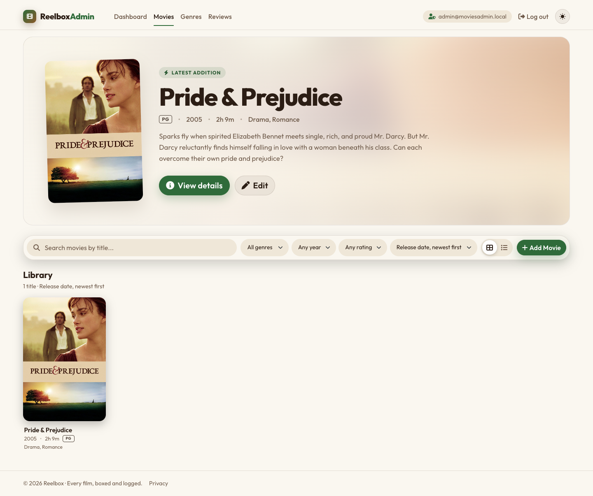
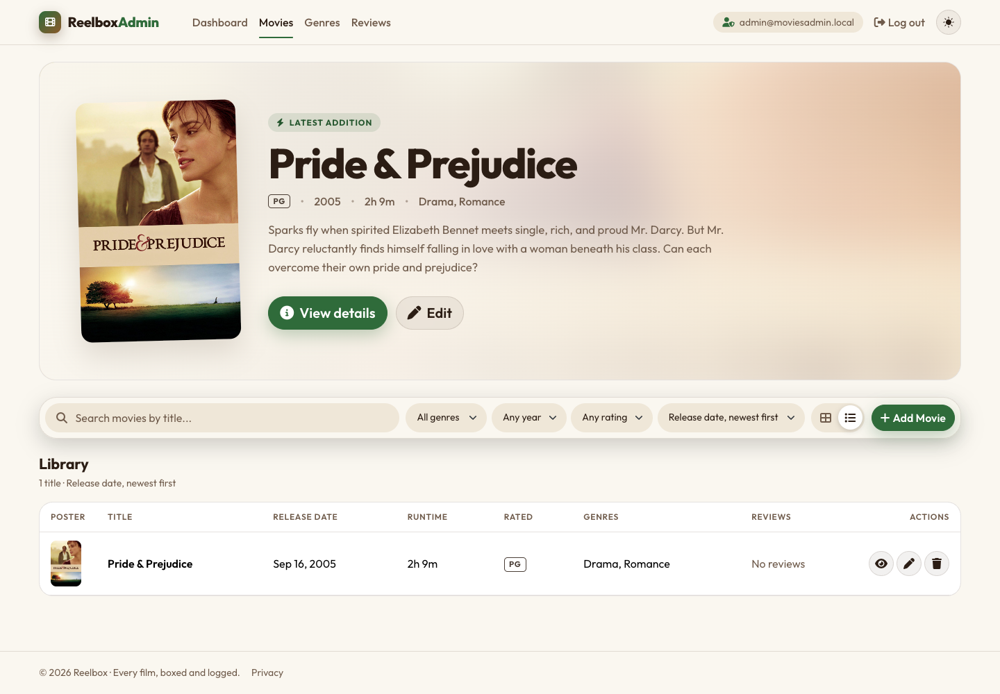
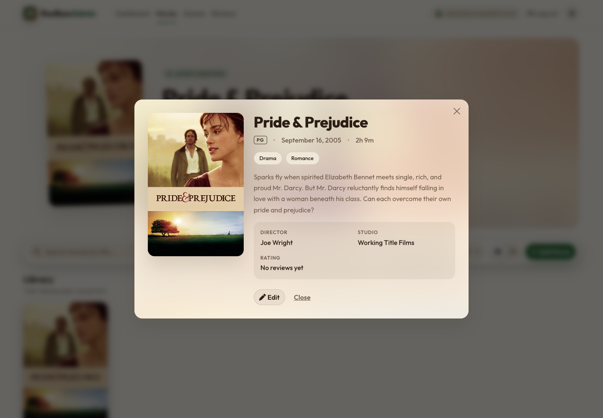
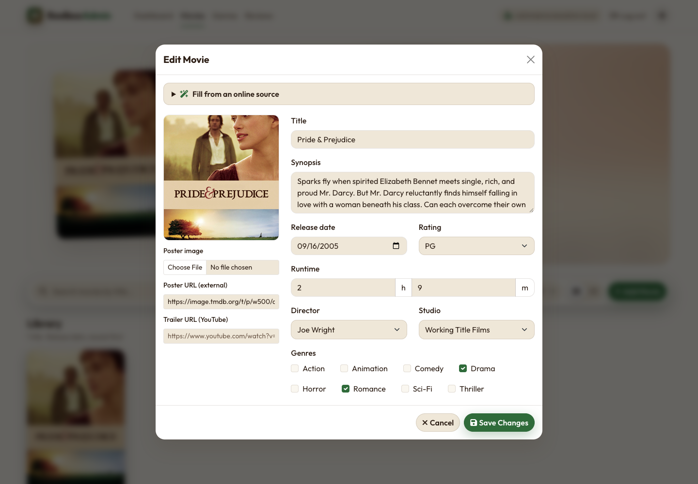
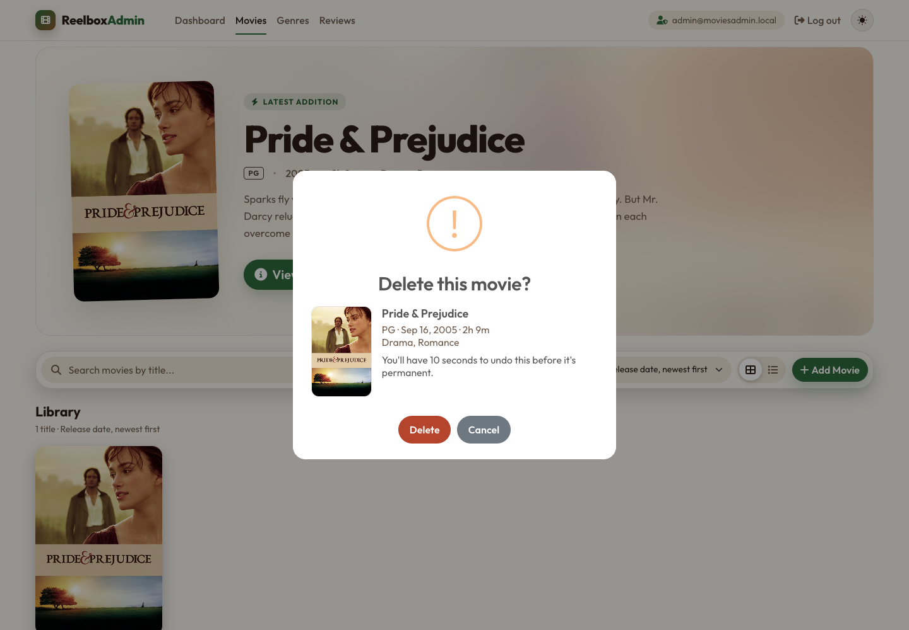
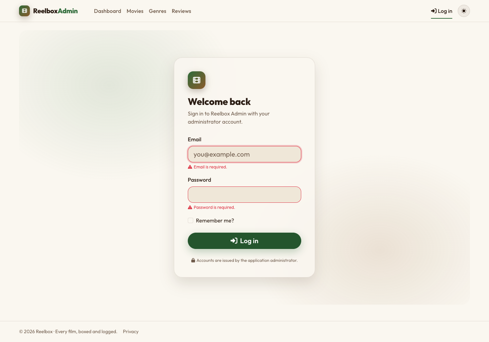
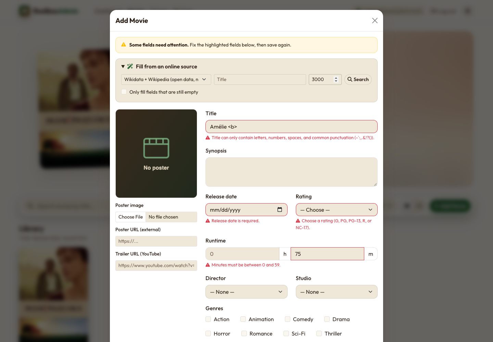

# Reelbox Admin: Movies Admin Application (MVC - ASP.NET)

**Course:** INET2005 - Web Application Programming I
**Instructor:** Michael Trumbull, Nova Scotia Community College

## Project Description

**Reelbox** is a Letterboxd-style movie logging and review site; **Reelbox Admin** (this repository, project name `MoviesAdmin`) is its back office. It's an ASP.NET Core MVC web application for managing and reviewing movies, modeled after a Rotten Tomatoes-style review platform. The Admin RBAC viewpoint of the application will allow users to browse movies and manage movie/genre data through an administrative interface. This is an atomic endpoint for Administrator access, and is part of the larger Movie Reviews solution, which includes browsing and submission of ratings/feedbacks/reviews.

## Screenshots

| Movies: featured hero, filters, and poster grid | Movies: list view |
| --- | --- |
|  |  |
| **Movie details** | **Add/Edit movie form** |
|  |  |
| **Delete confirmation (SweetAlert2)** | **Admin sign-in** |
|  |  |
| **Validation warnings** | |
|  | |

## Sprint 1 Requirements

| Requirement | How it's met |
| --- | --- |
| CRUD for movie data stored in a database | `MoviesController` Create/Edit/Delete/Details against SQL Server (Docker) through EF Core and `IMovieRepository` |
| Movie data: title, synopsis, genre, rating (e.g. PG-13), runtime hours/minutes, release date | `Movie` has `Title`, `Synopsis`, genres (many-to-many via `MovieGenre`, 8 seeded genres), `ContentRating` (G/PG/PG-13/R/NC-17), `RuntimeMinutes` (entered as hours + minutes, shown as e.g. "2h 9m"), and `ReleaseDate` |
| Summary list of all movies, sorted by release date, with add/view/update/delete | `/Movies` lists every movie sorted by release date (newest first) as a poster grid or table, with "Add Movie" in the toolbar and View/Edit/Delete on each movie |
| Good design principles and the site's brand | Reelbox Admin brand (green-to-brown film logo mark, forest-green "Admin" accent, Outfit type), consistent earth-tone (green, warm white, brown) light-first theme, responsive layout, accessible labels and focus states |

## Technology Stack

| Category | Technology | Purpose | Status |
| --- | --- | --- | --- |
| Framework | ASP.NET Core MVC (.NET 10) | Web application framework | In use |
| Programming language | C# | Application programming language | In use |
| Data access | Entity Framework Core | Database access and persistence | In use |
| Database | SQL Server 2022 (Developer Edition) in Docker | Relational database storage | In use — 6 migrations applied |
| Containerization | Docker Desktop + Docker Compose (`docker-compose.yml`) | Runs the local SQL Server with a persistent volume and health check | In use |
| Authentication | ASP.NET Core Identity | Config-provisioned accounts, login/logout, role-based access | In use |
| View technology | Razor Views (`.cshtml`) | Server-rendered user interface | In use |
| Front end | HTML5 / CSS3 / JavaScript | Front-end structure, styling, and behavior | In use |
| UI library | Bootstrap 5.3 (vendored under `wwwroot/lib/bootstrap`) | Responsive UI components, layout, and native `data-bs-theme` light/dark color modes | In use |
| Icons / typography | Font Awesome (solid, vendored) + Outfit (Google Fonts) | Button icons and the cinematic display type | In use |
| UI feedback | SweetAlert2 (vendored under `wwwroot/lib/sweetalert2`) | Delete confirmation dialogs, duplicate warnings, and the undo/success toasts on the Movies admin page | In use |
| Searchable pickers | Tom Select 2.6 (Apache-2.0, vendored under `wwwroot/lib/tom-select`) | Director and Studio fields: type to search, or add a new entry | In use |
| API integration | TMDB and OMDb (IMDb + Rotten Tomatoes scores) | Pre-fill the movie form: metadata, posters, trailers, and review scores | In use when API keys are configured (see [Movie lookup](#movie-lookup)); YouTube trailers embedded via `<iframe>` |
| Secrets | .NET user secrets + git-ignored `.env` | Connection string, seed admin, and API keys kept out of `appsettings*.json` and git | In use |

## CLI/Terminal Commands for Set-Up

Run commands from the repository root (`~/Desktop/MoviesAdmin`), one line at a time. macOS's zsh doesn't treat `#` as a comment in an interactive shell by default, so don't paste comment lines into the terminal (or run `setopt interactive_comments` first).

**Prerequisites:** .NET 10 SDK and Docker Desktop.

### First-time setup

| Step | Command |
| --- | --- |
| 1. Restore NuGet packages | `dotnet restore` |
| 2. Restore the local `dotnet-ef` tool (pinned in `dotnet-tools.json`) | `dotnet tool restore` |
| 3. Create your local secrets file, then edit the passwords (and optionally add API keys) | `cp .env.example .env` |
| 4. Copy `.env` into the app's user secrets (re-run whenever `.env` changes) | `./scripts/setup-secrets.sh` |
| 5. Start SQL Server in Docker (reads the same `.env`) | `docker compose up -d` |
| 6. Wait until the status shows `(healthy)` (~30–60s on Apple Silicon) | `docker compose ps` |
| 7. Create the database and apply all migrations | `dotnet ef database update --project MoviesAdmin` |
| 8. Run the app at http://localhost:5126 | `dotnet run --project MoviesAdmin` |
| 9. Sign in | `SEED_ADMIN_EMAIL` / `SEED_ADMIN_PASSWORD` from your `.env` |

### Day-to-day

| Task | Command |
| --- | --- |
| Start the database | `docker compose up -d` |
| Run the app | `dotnet run --project MoviesAdmin` |
| Run with hot reload | `dotnet watch --project MoviesAdmin` |
| Build only | `dotnet build` |
| Stop the app | `Ctrl+C` in its terminal, or `kill $(lsof -t -iTCP:5126 -sTCP:LISTEN)` |
| Stop the database (data is kept) | `docker compose down` |

### Docker database

The container is defined in `docker-compose.yml`: image `mcr.microsoft.com/mssql/server:2022-latest` pinned to `linux/amd64` (runs under Rosetta on Apple Silicon), container name `mssql_inet2005_701`, host port `MSSQL_PORT` from `.env` (default `1433`), and data in the named volume `moviesadmin_mssql-data`. The app connects through `ConnectionStrings:DefaultConnection` in user secrets, which `scripts/setup-secrets.sh` builds from the same `MSSQL_PORT` and `MSSQL_SA_PASSWORD`, so the port Docker opens and the port the app connects to always match. See [Configuration and secrets](#configuration-and-secrets).

| Task | Command |
| --- | --- |
| Start / create the container | `docker compose up -d` |
| Status and health | `docker compose ps` |
| Follow SQL Server logs | `docker compose logs -f mssql` |
| Restart | `docker compose restart mssql` |
| Stop and remove the container (volume kept) | `docker compose down` |
| **Delete everything, including the database volume** | `docker compose down -v` |
| Open an interactive SQL shell (uses the container's own `MSSQL_SA_PASSWORD`) | `docker exec -it mssql_inet2005_701 bash -c '/opt/mssql-tools18/bin/sqlcmd -S localhost -U sa -P "$MSSQL_SA_PASSWORD" -C -d MoviesAdmin'` |
| Run a one-off query | `docker exec mssql_inet2005_701 bash -c '/opt/mssql-tools18/bin/sqlcmd -S localhost -U sa -P "$MSSQL_SA_PASSWORD" -C -d MoviesAdmin -Q "SELECT Id, Title FROM Movies"'` |
| Check what holds port 1433 | `docker ps --filter publish=1433` |
| Pull a newer SQL Server image, then recreate | `docker compose pull` then `docker compose up -d` |

To change the SA password or host port, edit `.env`, run `./scripts/setup-secrets.sh`, then `docker compose up -d`. Compose recreates the container and keeps the volume. SQL Server only reads `MSSQL_SA_PASSWORD` when it first creates the `master` database, so an existing volume keeps its old password until you run `docker compose down -v`.

Troubleshooting:
- **`Bind for 0.0.0.0:1433 failed: port is already allocated`**: another container already uses 1433. Find it with `docker ps --filter publish=1433` and stop it with `docker stop <name>`, or set a different `MSSQL_PORT` in `.env` and re-run `./scripts/setup-secrets.sh`.
- **`ConnectionStrings:DefaultConnection is not configured`** on startup: user secrets haven't been written yet. Run `./scripts/setup-secrets.sh`.
- **`Login timeout expired` right after starting**: SQL Server is still booting under emulation. Wait for `(healthy)`.
- **`WARNING: The requested image's platform (linux/amd64) does not match...`**: harmless. Compose pins the platform, so it only appears with a hand-typed `docker run`.

### EF Core migrations

| Task | Command |
| --- | --- |
| List migrations (unapplied ones are marked `(Pending)`) | `dotnet ef migrations list --project MoviesAdmin` |
| Check whether the model has changes without a migration | `dotnet ef migrations has-pending-model-changes --project MoviesAdmin` |
| Create a migration after changing `Models/` or `ApplicationDbContext` | `dotnet ef migrations add <MigrationName> --project MoviesAdmin` |
| Apply all pending migrations to the Docker database | `dotnet ef database update --project MoviesAdmin` |
| Roll the database back to an earlier migration | `dotnet ef database update <MigrationName> --project MoviesAdmin` |
| Roll back everything (empty schema) | `dotnet ef database update 0 --project MoviesAdmin` |
| Remove the last migration (only if it's not applied) | `dotnet ef migrations remove --project MoviesAdmin` |
| Generate an idempotent SQL script of all migrations | `dotnet ef migrations script --idempotent --project MoviesAdmin -o migrations.sql` |
| Drop the database (asks for confirmation) | `dotnet ef database drop --project MoviesAdmin` |

Seed data uses `HasData` in `ApplicationDbContext`, so every value must be a constant. A dynamic value such as `Guid.NewGuid()` or `DateTime.Now` changes the model on every build and makes `database update` fail with `PendingModelChangesWarning`.

## Code First / Database First

- **Approach:** Code First — models drive the schema via EF Core migrations
- **Schema:** Six migrations, all applied to the Docker SQL Server database:
  1. `InitialMoviesReviewsSchema` — ASP.NET Core Identity tables plus `Movie`, `Genre`, `MovieGenre` (many-to-many join), and `Review`, with Fluent API config for cascade/restrict deletes and a unique index on genre name.
  2. `AddMoviePosterImagePath` — adds `Movie.PosterImagePath` for an admin-uploaded poster image (kept separate from `PosterUrl`, which is reserved for posters sourced from an external movie API).
  3. `AddDirectorStudioTrailer` — adds the `Director` and `Studio` entities (each one-to-many with `Movie`, `Restrict` delete so removing one doesn't silently orphan its movies) and the `Trailer` entity (one-to-one with `Movie`, `Cascade` delete, stores just the admin-entered YouTube URL).
  4. `AddIamRoles` — seeds the `Admin` and `Viewer` roles (fixed Ids and `ConcurrencyStamp`s so the seed is deterministic).
  5. `SeedDirectorsStudios` — seeds five director/studio pairs (Joe Wright / Working Title Films, Greta Gerwig / Columbia Pictures, Christopher Nolan / Syncopy, Denis Villeneuve / Legendary Pictures, Bong Joon-ho / Barunson E&A) and a sample movie, *Pride & Prejudice* (2005), with its TMDB poster as `PosterUrl`.
  6. `SeedGenresContentRating` — adds `Movie.ContentRating` (stored as the enum name, e.g. `PG13`), seeds eight genres (Action, Animation, Comedy, Drama, Horror, Romance, Sci-Fi, Thriller), and rates *Pride & Prejudice* PG with Drama/Romance.
- **Repository / Dependency Injection Pattern:** Implemented — generic `IRepository<T>`/`Repository<T>` base plus entity-specific `IMovieRepository`/`IGenreRepository`/`IReviewRepository`/`IDirectorRepository`/`IStudioRepository`, all registered in `Program.cs`. `Trailer` has no queries beyond plain CRUD, so it resolves through the generic `IRepository<Trailer>` registration instead of a dedicated pair.
- **Authentication:** ASP.NET Core Identity (`ApplicationUser`, `ApplicationDbContext : IdentityDbContext`) with `AccountController` (Login/Logout/AccessDenied only — no registration) and matching views/view models; the navbar in `_Layout.cshtml` exposes Dashboard/Movies/Genres/Reviews links with auth-aware login/logout controls

## IAM (Identity/Access Management)

- **No self-registration.** `AccountController` only signs in/out. Every account is declared in the `SeedUsers` configuration section (email, password, display name, and **role**), and `Data/IdentitySeeder.cs` creates any missing account on startup and assigns its role. Existing passwords are never overwritten from config.
- **Roles** `Admin` and `Viewer` are seeded via `HasData` in `ApplicationDbContext` (migration `AddIamRoles`, with fixed `ConcurrencyStamp`s so the seed is deterministic).
- `Program.cs` registers a `"RequireAdmin"` policy; `MoviesController` is gated behind it, so only `Admin` accounts can manage movies. Anonymous visitors are redirected to `/Account/Login`; other roles get `/Account/AccessDenied`.
- Credentials are never committed: in development the seed admin comes from `.env` via user secrets (`SeedUsers:0:*`); elsewhere, supply environment variables such as `SeedUsers__0__Password`.

## Movies Admin CRUD

`MoviesController` + `Views/Movies/*` + `wwwroot/js/movies.js` implement a full CRUD screen at `/Movies`, styled after streaming sites such as Movy/Cineby:

- **Featured hero (`_MovieHero.cshtml`):** the most recently added movie over a blurred copy of its poster, with View details/Edit actions. Re-fetched from `GET /Movies/Hero` after every create/edit/delete so it never shows a stale or deleted movie.
- **Catalog (`_MovieCatalog.cshtml`):** every movie, sorted by release date (newest first). One partial renders both a responsive poster grid (hover lift and zoom, play button to view, edit/delete bar; year, runtime, rating badge, and genres under each poster) and a list table (poster thumbnail, title, release date, runtime, content rating, genres, review average, and View/Edit/Delete kept together in one cell per row). A grid/list toggle switches between them and is remembered per browser. Populated by `IMovieRepository.SearchAsync`.
- **Toolbar:** search, genre/year/rating filters, sort order, grid/list toggle, and "Add Movie" share one sticky glass toolbar (filters wrap to their own row on phones).
- **Async search, filter, and sort:** the toolbar is a GET form whose fields bind to `MovieCatalogQuery` (`q`, `genreId`, `year`, `rating`, `sort`). Typing in the search box (debounced 300ms) or changing a dropdown calls `GET /Movies/Search?...`, which validates every parameter through data annotations on `MovieCatalogQuery` (the search text against a timeout-guarded regex) and returns the catalog partial to swap into `#movie-catalog`. The filters and sort are applied in SQL by `IMovieRepository.SearchAsync` before `ToListAsync()`. The URL is kept in step (`/Movies?genreId=4&sort=TitleAsc`), so reloads and shared links keep the view. Sort options: release date (newest/oldest), title (A–Z/Z–A), review score, and runtime (longest/shortest).
- **Validation:** see [Validation](#validation).
- **Online lookup:** see [Movie lookup](#movie-lookup).
- **Create/Edit:** "Add Movie" and each row's "Edit" button load `_MovieFormModal.cshtml` into a shared Bootstrap modal via `GET /Movies/CreateModal` / `GET /Movies/EditModal/{id}`, submitted back via `fetch()` + `FormData` (so the poster file upload works) to `POST /Movies/Create` / `POST /Movies/Edit/{id}`. A 422 response re-renders the same partial with validation messages without closing the modal. The form's image column doubles as an image-left/details-right layout, and includes a required content-rating dropdown (G/PG/PG-13/R/NC-17), runtime as separate hours and minutes inputs, Director/Studio dropdowns, a Genre checkbox list, and a Trailer YouTube URL field.
- **View (Details):** each row's "View" button loads `_MovieDetailsModal.cshtml` via `GET /Movies/DetailsModal/{id}` — poster on the left, details (release date, runtime, director, studio, genres, rating, synopsis) on the right. If the movie has a trailer, a "Watch Trailer" button lazily fetches the `<iframe>` embed from `GET /Movies/TrailerEmbed/{id}` only when clicked, rather than embedding a YouTube player for every row up front.
- **Delete:** a SweetAlert2 confirmation dialog (styled with the same poster-left/details-right layout, built from `data-*` attributes on the row's Delete button — no extra round trip) precedes deletion. On confirm, the row is greyed out client-side and a SweetAlert2 toast with a 10-second countdown and an "Undo" button appears; `POST /Movies/Delete/{id}` is only called if the countdown fully elapses without Undo being clicked, so nothing is actually removed from the database during the grace window.
- **Modal styling:** `.modal-backdrop.show` gets a `backdrop-filter: blur(6px)` in `site.css` so Create/Edit/View dialogs blur the page behind them; the View modal adds a blurred-poster wash. SweetAlert2 dialogs follow the site theme (`theme: 'dark'`/`'light'`).
- **Poster images:** uploaded files are validated by `[PosterFile]` (`.jpg/.jpeg/.png/.gif/.webp`, ≤5MB, checked in the browser and on the server) and saved under `wwwroot/images/movies/` with a generated filename; `Movie.PosterImagePath` takes display priority over `Movie.PosterUrl`, which falls back to a generated placeholder SVG when neither is set.

## Current Core, Enhancing, and Enabling Features

*(Reference wireframe: Rotten Tomatoes; visual style: Movy / Cineby)*

### Core
- [x] Movie browse page: featured hero, poster grid, and list view at `/Movies`, sorted by release date (newest first)
- [x] Movie data: title, synopsis, genres, content rating (G/PG/PG-13/R/NC-17), runtime in hours/minutes, release date
- [x] Movie details: modal with poster, meta, genres, director, studio, synopsis, and lazy-loaded YouTube trailer
- [x] Movie create/edit: modal form posted via `fetch()` through `MoviesController` into the Docker database, with server-side validation (422 re-render)
- [x] Movie delete: SweetAlert2 confirmation plus a 10-second Undo window before anything is removed
- [x] Poster images: upload (validated type/size) or external URL, with a placeholder fallback
- [ ] User-submitted reviews and ratings (schema in place, UI planned)

### Enhancing
- [x] Async title search (debounced, regex-validated)
- [x] Grid/list catalog toggle, remembered per browser
- [x] Searchable Director and Studio pickers: type to filter, or add a new one on the spot; adding a name that already exists (ignoring case and extra spaces) shows an alert and selects the existing entry
- [x] Eight seeded genres, selectable as checkboxes on the form
- [x] Filter by genre, release year, and content rating
- [x] User-selectable sort order (release date, title, review score, runtime), reflected in the URL
- [x] Client- and server-side validation warnings with plain-English messages
- [x] Movie lookup from Wikidata + Wikipedia (no key needed), TMDB, or OMDb (IMDb + Rotten Tomatoes scores) to pre-fill the form, still fully editable

### Enabling
- [x] Code First schema with 6 EF Core migrations applied
- [x] Secrets out of source control: connection string, seed admin, and API keys in user secrets, fed from a git-ignored `.env` shared with Docker Compose
- [x] SQL Server 2022 containerized with Docker Compose (persistent volume, health check)
- [x] Repository + dependency injection pattern
- [x] ASP.NET Core Identity login/logout
- [x] Role-based access control: `Admin`/`Viewer` roles, `RequireAdmin` policy on `MoviesController`
- [x] Accounts provisioned from configuration (`SeedUsers` → `IdentitySeeder`); self-registration removed
- [x] Earth-tone UI: forest green, warm white, and brown (glass navbar, hero, poster cards, themed modals and alerts)
- [x] Responsive layout for desktop and mobile
- [x] Light/dark mode toggle
- [ ] Admin screens for Genres, Directors, Studios, and Reviews
- [ ] Containerize the ASP.NET app itself (Dockerfile + compose service)

## Configuration and secrets

Nothing secret lives in `appsettings*.json` or git. `.env` (git-ignored; template in `.env.example`) is the single local source:

| `.env` value | Used by |
| --- | --- |
| `MSSQL_PORT`, `MSSQL_SA_PASSWORD` | `docker-compose.yml` (published port and SA password) **and** the connection string |
| `SEED_ADMIN_EMAIL`, `SEED_ADMIN_PASSWORD`, `SEED_ADMIN_DISPLAY_NAME` | `SeedUsers:0:*`, read by `Data/IdentitySeeder.cs` |
| `TMDB_API_KEY`, `OMDB_API_KEY` (optional) | `MovieLookup:TmdbApiKey` / `MovieLookup:OmdbApiKey` |

`scripts/setup-secrets.sh` writes these into the project's [user secrets](https://learn.microsoft.com/aspnet/core/security/app-secrets) (`UserSecretsId` in `MoviesAdmin.csproj`; stored under `~/.microsoft/usersecrets/`), which ASP.NET Core and `dotnet ef` load automatically in Development. Inspect them with `dotnet user-secrets list --project MoviesAdmin`. Outside Development, use environment variables (`ConnectionStrings__DefaultConnection`, `SeedUsers__0__Password`, `MovieLookup__TmdbApiKey`, ...). The app stops at startup with a clear message if the connection string is missing.

> Older commits contain the previous development SA and admin passwords in `appsettings.Development.json`. Treat those values as public and choose new ones in `.env`. A new SA password only applies to a fresh volume (`docker compose down -v`).

## Validation

- **Annotations with messages:** every input rule on the form and entity models (`[Required]`, `[StringLength]` with min/max, `[Range]`, `[RegularExpression]`, `[EnumDataType]`) has its own message, e.g. "Title must be between 1 and 200 characters." or "Minutes must be between 0 and 59."
- **Custom attributes** (`Validation/`): `[ReleaseDate]` (between 14 Oct 1888 and five years from today) and `[PosterFile]` (image type and ≤5 MB). Both validate on the server and emit `data-val-*` rules for the browser.
- **Nullable vs. non-nullable:** form inputs that can be blank in the browser are nullable and marked `[Required]` where needed (e.g. `ReleaseDate`, `ContentRating`), so a blank field gets the attribute's message instead of a type error. MVC's own binding errors (letters in a number box, a non-existent enum value) are reworded in `Program.cs` (`ModelBindingMessageProvider`).
- **Warnings in the UI:** the AJAX-loaded form is parsed by jquery-validation-unobtrusive (`wwwroot/js/validation.js` adds the custom rules and Unicode-aware regexes), so invalid fields get a red border and a ⚠ message as you type. Submitting with errors shows a "Some fields need attention" banner. The server re-checks everything (including that the director, studio, and genre ids exist) and re-renders the same warnings with HTTP 422.

## Director and Studio pickers

The Director and Studio fields on the Add/Edit form are searchable comboboxes ([Tom Select](https://tom-select.js.org/)). Type to filter the list, or choose **Add "…"** to create a new entry without leaving the form; it's saved right away and selected.

Duplicates are blocked twice. The browser first compares the name to the list (ignoring case and extra spaces). The server then checks again in `MovieOptionsController` (`POST /MovieOptions/AddDirector`, `POST /MovieOptions/AddStudio`, Admin only, anti-forgery protected), with the unique index on `Name` as the final guard. Either way, a duplicate shows a "Director already exists" / "Studio already exists" alert and selects the existing entry. New names follow the same validation rules as the `Director` and `Studio` models.

## Movie lookup

The Add/Edit form has a **Fill from an online source** panel. Choose a source, search by title (and optionally year), then pick a result to copy its details into the form. Nothing is saved until you press Save, and every field stays editable. Tick **Only fill fields that are still empty** (on by default when editing) to keep values you've already entered.

| Source (dropdown) | What it fills | Review scores shown |
| --- | --- | --- |
| **Wikidata + Wikipedia (open data, no key)** (default) | Title, synopsis (Wikipedia lead paragraph), US release date, runtime, MPA rating, YouTube trailer, director, studio, genres; poster only when Wikimedia Commons has one | None |
| **TMDB (The Movie Database)** | Title, synopsis, release date, runtime, US rating, poster, YouTube trailer, director, studio, genres | TMDB user score |
| **IMDb + Rotten Tomatoes (via OMDb)** | Title, plot, release date, runtime, rating, poster, director, genres | IMDb, Rotten Tomatoes, Metacritic |

Wikidata (CC0) and Wikipedia (CC BY-SA) are open data with public APIs, so that source works with no setup; requests identify the app with a descriptive User-Agent as Wikimedia's API policy asks. IMDb and Rotten Tomatoes don't offer public APIs; OMDb is the usual way to get IMDb data and Rotten Tomatoes/Metacritic scores. Directors, studios, and genres are matched by name to existing records ("Science Fiction" maps to "Sci-Fi"). An unmatched director or studio is listed under the result with an **Add it** button; unmatched genres are just listed. Review scores are shown for reference and aren't stored.

To turn on TMDB or OMDb, get a free key ([TMDB](https://www.themoviedb.org/settings/api): API key or read access token; [OMDb](https://www.omdbapi.com/apikey.aspx)), add it to `.env`, run `./scripts/setup-secrets.sh`, and restart the app. Sources without a key are listed but disabled. Code: `Services/MovieLookup/` (one `IMovieLookupProvider` per source, typed `HttpClient`s registered in `Program.cs`) and `Controllers/MovieLookupController.cs` (`GET /MovieLookup/Search`, `GET /MovieLookup/Details`, Admin only).

## Light/Dark Mode

The site uses an earth-tone palette (forest green, warm white, and brown, with terracotta for destructive actions) and is light by default, with an espresso-brown dark variant behind the navbar toggle. Text and accent colors meet WCAG AA contrast in both modes. It uses Bootstrap 5.3's native `data-bs-theme` color modes:

- An inline script in `_Layout.cshtml`'s `<head>` sets `data-bs-theme` on `<html>` before first paint (a saved choice in `localStorage`, otherwise `light`), so there's no flash on load.
- The sun/moon button in the navbar (`#theme-toggle`, wired up in `wwwroot/js/site.js`) switches modes and remembers the choice in `localStorage`.
- All custom colors are `--ma-*` tokens in `wwwroot/css/site.css`, defined for both modes; Bootstrap's `--bs-*` variables are pointed at them so stock components (forms, tables, modals) match.

## Suggested Future Data Models

`Director`, `Studio`, and `Trailer` (below) have since been implemented. Beyond the current
`Movie` / `Genre` / `MovieGenre` / `Review` / `ApplicationUser` / `Director` / `Studio` / `Trailer`
schema, these are natural next additions as the Rotten-Tomatoes-style feature set grows:

| Model | Purpose | Relationship |
| --- | --- | --- |
| `Actor` | Cast member profile (name, bio, photo) | Many-to-many with `Movie` via a `MovieActor` join (with a `Role`/character-name field on the join) |
| `ContentRating` | MPAA-style rating (G, PG, PG-13, R, etc.) | One-to-many with `Movie` |
| `Tag` | Free-form keywords (e.g. "based on a true story") | Many-to-many with `Movie` via a `MovieTag` join |
| `Watchlist` / `WatchlistItem` | Per-user "want to watch" list | `Watchlist` one-to-one with `ApplicationUser`; `WatchlistItem` many-to-one with `Watchlist` and `Movie` |
| `FavoriteMovie` | Per-user favorites/likes | Join between `ApplicationUser` and `Movie` |
| `ReviewComment` | Replies/discussion on a `Review` | Many-to-one with `Review` and `ApplicationUser` |
| `MovieImage` | Additional stills/gallery images beyond the poster | Many-to-one with `Movie` |
| `Award` | Awards/nominations won by a movie | Many-to-one with `Movie` (or many-to-many if shared across movies, e.g. franchise awards) |

These aren't scheduled yet — they're a roadmap for extending the Code First schema further once the core `Movies`/`Genres`/`Reviews` admin screens are built out.

### Implemented: Director, Studio, Trailer

- **`Director`** — `Id`, `Name` (unique), optional `Bio`. One-to-many with `Movie` (`Movie.DirectorId`, nullable, `Restrict` delete).
- **`Studio`** — `Id`, `Name` (unique). One-to-many with `Movie` (`Movie.StudioId`, nullable, `Restrict` delete).
- **`Trailer`** — `Id`, `MovieId` (unique — one-to-one), `YouTubeUrl`, `AddedAt`. Only the URL is persisted; `YouTubeVideoId`/`EmbedUrl` are computed (`[NotMapped]`) from it on read via `YouTubeTrailerHelper`, so nothing user-supplied is ever written straight into the page as HTML. `Movie.Trailer` is the reverse navigation (`Cascade` delete — a trailer has no meaning without its movie).

`Director`/`Studio` don't have their own management screens yet (same gap as `Genre` today). They're wired into the Movie Create/Edit form as dropdowns and into the Details view, and five of each are seeded by the `SeedDirectorsStudios` migration. Adding more currently means extending that `HasData` seed and adding a migration, until an admin screen exists.